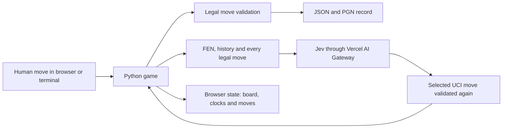

<h1 align="center">Human vs Jev: Chess</h1>

<p align="center">A human and TypeSafe AI's Jev play a complete game of chess from the same legal position.</p>

## How it works

1. **Board.** Python owns the position, legal moves, clocks and result. [`python-chess`](https://python-chess.readthedocs.io/) handles the rules; the browser only draws the state it receives.
2. **Human.** Choose White or Black, then click a piece and one of its marked legal squares. Castling, en passant and promotion go through the same move validator as every other move.
3. **Question.** On Jev's turn the game sends its current FEN, side to move, move history and the complete set of legal moves to the Vercel AI Gateway.
4. **Choice.** Each legal UCI move is one choice, with its SAN form as context. Jev must select one of those choices and Python checks it again before changing the board.
5. **Record.** The game writes JSON after every move. A finished game also becomes PGN. Replays rebuild the position one legal move at a time and reject a changed SAN, final FEN or result.
6. **Interface.** Flask serves a small HTML, CSS and JavaScript board. It shows both clocks, whose turn it is, the move list, check, the last move and Jev's thinking or retry state.

## System design



The browser never decides whether a move is legal. The same game, Jev client and record writer are used by the terminal script and the web server.

## Results

Jev played two games against each Elo-limited Stockfish 19 opponent, once with each color. Stockfish used 0.1 seconds per move. Every game ended by checkmate.

| Stockfish Elo | Jev wins | Stockfish wins | Game lengths |
| ---: | ---: | ---: | --- |
| 1350 | 0 | 2 | 44, 59 plies |
| 1700 | 0 | 2 | 82, 39 plies |
| 2100 | 0 | 2 | 56, 45 plies |
| 2500 | 0 | 2 | 54, 53 plies |

This small run shows Jev below the tested 1350 setting; it is not enough games to assign a precise rating. The complete benchmark summary is in [`results/stockfish-benchmark.json`](results/stockfish-benchmark.json). Run another matrix with:

```bash
python scripts/benchmark.py path/to/stockfish
```

## Demo

No demo video has been recorded yet. The browser board runs locally with the commands below.

## Run it

Python 3.11 or newer is required.

```bash
python -m venv .venv
source .venv/bin/activate                 # Windows: .venv\Scripts\activate
python -m pip install -e ".[test]"
python -m pytest
```

Put the Vercel AI Gateway key in `.env`, then start the browser game:

```text
AI_GATEWAY_API_KEY=your-key-here
```

```bash
python scripts/serve.py
```

Open [http://127.0.0.1:5000](http://127.0.0.1:5000). To play entirely in the terminal instead:

```bash
python scripts/play.py --color white
python scripts/play.py --color black
```

Validate an exact saved replay or export the real result totals:

```bash
python scripts/replay.py results/games/<game-id>.json
python scripts/export_results.py
```

| Folder | What's in it |
| --- | --- |
| [`jevchess/`](jevchess/) | authoritative game state, Jev's legal-choice request, saved records and Flask API |
| [`scripts/`](scripts/) | terminal play, local server, exact replay and result export commands |
| [`web/`](web/) | the thin browser board, styles and interaction code |
| [`results/`](results/) | saved JSON games, PGNs and generated summaries |
| [`tests/`](tests/) | rules, clocks, Jev responses, persistence, replay, scripts and API behavior |

## Credits

Jev by [TypeSafe AI](https://www.typesafe.ai) through the [Vercel AI Gateway](https://vercel.com/ai-gateway/models/jev). Chess rules, SVG pieces and PGN support by [`python-chess`](https://python-chess.readthedocs.io/).
