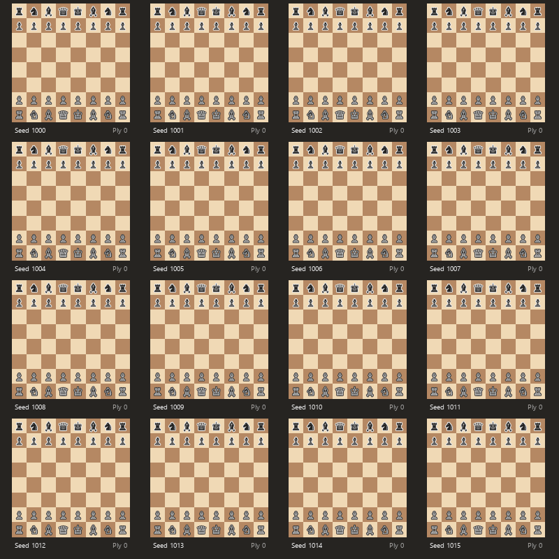
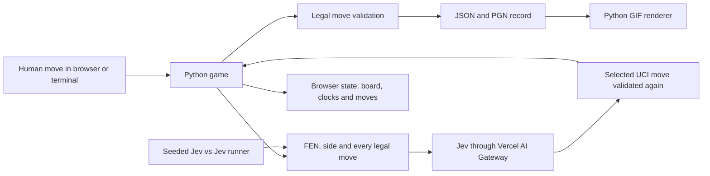

<h1 align="center">Jev Chess</h1>

<p align="center">Play a complete game against Jev, or watch seeded Jev-vs-Jev matches unfold from Python.</p>



## How it works

1. **Board.** Python owns the position, legal moves, clocks and result. [`python-chess`](https://python-chess.readthedocs.io/) handles the rules; the browser only draws the state it receives.
2. **Human.** Choose White or Black, then click a piece and one of its marked legal squares. Castling, en passant and promotion go through the same move validator as every other move.
3. **Question.** On Jev's turn the game sends its current FEN, side to move and the complete set of legal UCI moves to the Vercel AI Gateway.
4. **Choice.** Every legal move is a named choice. Jev can only select one of them, and Python checks the move again before changing the board.
5. **Record.** The game writes JSON after every move. A finished game also becomes PGN. Replays rebuild the position one legal move at a time and reject a changed SAN, final FEN or result.
6. **Interface.** Flask serves a small HTML, CSS and JavaScript board. It shows both clocks, whose turn it is, the move list, check, the last move and Jev's thinking or retry state.

## System design



The browser never decides whether a move is legal. The terminal, web server and simulation runner share the same Python game, Jev client and record writer. Simulation rounds send all active positions in one request, then use a deterministic seed to sample each returned legal-move distribution.

## Results

The demo ran 16 seeded Jev-vs-Jev games to checkmate or an 80-ply display cap. Two games ended in checkmate and every saved move replays exactly.

| Games | White wins | Black wins | 80-ply draws | Checkmate lengths |
| ---: | ---: | ---: | ---: | --- |
| 16 | 2 | 0 | 14 | 57, 77 plies |

The exact summary is in [`results/jev-vs-jev.json`](results/jev-vs-jev.json), with a JSON replay and PGN for every board in [`results/jev-vs-jev-games/`](results/jev-vs-jev-games/).

Jev played two games against each Elo-limited Stockfish 19 opponent, once with each color. Stockfish used 0.1 seconds per move. Every game ended by checkmate.

| Stockfish Elo | Jev wins | Stockfish wins | Game lengths |
| ---: | ---: | ---: | --- |
| 1350 | 0 | 2 | 44, 59 plies |
| 1700 | 0 | 2 | 82, 39 plies |
| 2100 | 0 | 2 | 56, 45 plies |
| 2500 | 0 | 2 | 54, 53 plies |

This small run shows Jev below the tested 1350 setting; it is not enough games to assign a precise rating. The complete benchmark summary is in [`results/stockfish-benchmark.json`](results/stockfish-benchmark.json). Run another matrix with:

```bash
python scripts/benchmark.py path/to/stockfish
```

## Demo

The GIF above is rendered entirely in Python from the 16 exact JSON replays. All boards share a ply counter; completed games stop moving while the others continue. Rebuild both the games and GIF with:

```bash
python scripts/simulate.py
python scripts/render_simulation.py
```

## Run it

Python 3.11 or newer is required.

```bash
python -m venv .venv
source .venv/bin/activate                 # Windows: .venv\Scripts\activate
python -m pip install -e ".[test]"
python -m pytest
```

Put the Vercel AI Gateway key in `.env`, then start the browser game:

```text
AI_GATEWAY_API_KEY=your-key-here
```

```bash
python scripts/serve.py
```

Open [http://127.0.0.1:5000](http://127.0.0.1:5000). To play entirely in the terminal instead:

```bash
python scripts/play.py --color white
python scripts/play.py --color black
```

Validate an exact saved replay or export the real result totals:

```bash
python scripts/replay.py results/games/<game-id>.json
python scripts/export_results.py
```

| Folder | What's in it |
| --- | --- |
| [`jevchess/`](jevchess/) | game state, Jev players, simulation, saved records, renderer and Flask API |
| [`scripts/`](scripts/) | play, serve, simulate, render, replay, benchmark and export commands |
| [`web/`](web/) | the thin browser board, styles and interaction code |
| [`results/`](results/) | saved JSON games, PGNs and generated summaries |
| [`media/`](media/) | the rendered Jev-vs-Jev demo |
| [`tests/`](tests/) | rules, clocks, Jev responses, persistence, replay, scripts and API behavior |

## Credits

Jev by [TypeSafe AI](https://www.typesafe.ai) through the [Vercel AI Gateway](https://vercel.com/ai-gateway/models/jev). Chess rules, SVG pieces and PGN support by [`python-chess`](https://python-chess.readthedocs.io/).
